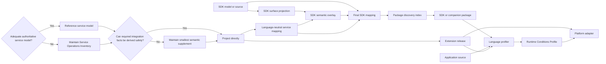

# SDK Support Workflow and Ownership

## Status and generation labels

This document summarizes the current end-to-end SDK support architecture. It separates service semantics from SDK language mechanics so neither service owners nor SDK authors maintain facts owned by the other.

- **Maintained:** a human owns semantic decisions or exceptions and must reconcile meaningful upstream changes.
- **Potentially auto-generated:** an owner can plausibly emit the artifact from an existing model or generator, but Runtime Conditions does not yet have proven generic tooling for it. Current project-specific compilers do not qualify as generic automation.
- **Auto-generated:** we have strong confidence that SDK-independent open-source Runtime Conditions tooling can produce the artifact. Human review may still gate publication.

## End-to-end relationship

The authoritative model or fallback inventory and service mapping are authoring inputs. A semantic supplement joins them only when the authority has a demonstrated gap. Application profilers and platform adapters do not ordinarily load any of those service-authoring inputs. The extension is the standalone profile vocabulary; the SDK mapping connects source calls to that vocabulary; the generated profile is the runtime handoff to an adapter.

## Service-owner workflow

| Artifact | Generation status | Purpose and relationship | Maintenance and failure conditions |
| --- | --- | --- | --- |
| **Authoritative service model** such as Smithy, OpenAPI, protobuf, MongoDB IDL, or an equivalent provider model | **Potentially auto-generated** through the service owner's existing workflow | Preferred language-neutral authority for operations, inputs, and service-owned constraints. Runtime Conditions tooling should project it directly whenever possible rather than copy or wrap it. | Maintained as part of the service itself. New operations, renamed inputs, model restructuring, or generator changes may invalidate downstream references. |
| **Normalized service projection** | **Potentially auto-generated** | Optional disposable normalization when the authoritative format cannot be consumed directly. It remains subordinate to the exact upstream model and is not a second maintained authority. | Regenerated when the source changes. Projectors currently differ by source format and are not yet one generic Runtime Conditions tool. |
| **Service Operations Inventory** (`service-operations-inventory.yaml`) | **Maintained; fallback only** | Last-resort language-neutral authority when no adequate machine-readable service model exists. It contains service operations and inputs but no Runtime Conditions or SDK semantics. | Service stakeholders reconcile new, removed, or changed operations. Generic tooling may validate its future schema, but cannot infer the missing service facts. |
| **Optional Service Operations Semantic Bridge** (`service-operations-semantic-bridge.yaml`) | **Maintained only when required** | Smallest supplement for a specific integration fact or projection exception that cannot be derived safely from the authoritative model or fallback inventory. It is omitted when direct projection is sufficient. | Review only when an affected residual decision changes. It must not restate source facts, hold ordinary compiler configuration, or become an SDK-author obligation. |
| **Runtime Conditions extension release** (`runtimeconditions.extension.yaml`) | **Potentially auto-generated** from the operation authority and any necessary supplement | Standalone vocabulary and validation contract consumed by profiles, profilers, validators, no-op bindings, and adapters. It contains no SDK symbols or authoring paper trail. | A new immutable release is required only when adapter-facing vocabulary or validation changes. Current compilers are extension-specific, so generic generation is not yet proven. |
| **Language-neutral service mapping** (`<service>-service-mapping.yaml`) | **Potentially auto-generated** from the operation authority and any necessary supplement | Canonical projection from service operations to exact extension Conditions and bindings. All language SDK mappings for the service consume it. It is not ordinary adapter runtime input. | Regenerates when operation projections or extension coordinates change. A new source operation can change this mapping without changing extension vocabulary. Current compilers are service-specific. |
| **Extension no-op bindings and language packages** | **Maintained today** | Application fallback when SDK detection is absent or incomplete. They expose extension-owned declarations, not SDK method mappings. | Must remain aligned with extension vocabulary. Cross-language binding generation is not yet proven generic and may require language templates or maintained code. |
| **Content digests and reference-integrity checks** | **Auto-generated** | Pin exact source, optional-supplement, extension, service-mapping, and packaged-mapping content and detect broken references without changing meaning. | Recomputed on every build. A mismatch blocks publication but never decides whether a change is acceptable. |
| **Service-source maintenance workflow** | **Maintained configuration; potentially auto-generated evidence** | Pins repositories, revisions, model paths, and replay inputs, then runs direct-projection and optional-supplement checks when the authoritative API changes. Its reports are review evidence, not published service semantics. | Reconcile repository moves, release conventions, model layout, and source-generator changes. Only genuinely non-derivable classifications remain human decisions. |

The service owner maintains one service path for many SDK languages and releases. It does not maintain Python, Go, Java, or other SDK symbols in the extension or service mapping, and it should not maintain a semantic supplement when direct projection is possible.

## SDK-author workflow

| Artifact or integration | Generation status | Purpose and relationship | Maintenance and failure conditions |
| --- | --- | --- | --- |
| **SDK API model and public source** | **Potentially auto-generated** for model-generated SDKs; otherwise maintained normally | Existing SDK authority for released classes, functions, methods, parameters, types, wrappers, and package ownership. | Changes through the SDK's normal release process. Generator redesigns, source-layout changes, and handwritten behavior changes can invalidate Runtime Conditions integration tooling. |
| **SDK surface projection** | **Potentially auto-generated** | Mechanical list of candidate public symbols, signatures, generated endpoints, and source locations derived from the exact SDK release. It does not decide what a method means. | Regenerated per release. Generated SDKs can often emit it from existing models; handwritten and dynamic APIs may require language-aware source inspection. Current projectors are SDK-specific experiments. |
| **SDK semantic overlay** | **Maintained** | Smallest intended human review surface. It associates SDK-owned methods with canonical service operations and records bindings, returned state, dependency identity, wrappers, delegation, or execution paths that source generation cannot prove safely. | Reconcile new or renamed methods, parameter changes, new wrappers, altered state flow, and changed execution paths. Ordinary releases with no semantic surface change should require no edit. |
| **Public-surface classification policy** | **Maintained maintenance control** | Records whether newly discovered public behavior is mapped, intentionally excluded, or deferred. It prevents silent drift but is not shipped in application mappings or profiles. | Every new relevant public symbol needs a focused decision. Counts and unresolved classifications remain maintenance evidence, not mapping-layer coverage claims. |
| **SDK mapping projector/compiler or generator plugin** | **Potentially part of existing SDK generation; maintained integration code today** | Joins exact SDK facts and the reviewed overlay to the service mapping, validates references, and produces release metadata. | Current proofs use per-SDK compilers, so this is not generic auto-generation. Source-generator or mapping-contract changes may require implementation maintenance even when semantics do not change. |
| **Final SDK mapping** (`runtimeconditions.sdk-mapping.yaml`) | **Potentially auto-generated; never hand-edited** | Self-contained mapping for one SDK distribution and version. It resolves public symbols to canonical operations, exact extension coordinates, bindings, state, composition, and dependency identity. | Regenerate when the SDK release, overlay, service mapping, or target extension changes. Generated SDKs may emit it from their existing pipeline; handwritten SDKs currently need integration-specific compilation. |
| **Package discovery index** (`runtimeconditions/index.yaml`) and content digests | **Auto-generated** | Small SDK-independent index naming each packaged mapping, its owning package/version, and its digest so a profiler can discover metadata without importing SDK code. | Regenerated with the package. A mismatch, missing mapping, or wrong package version fails closed. |
| **Package-data/build declaration** | **Maintained, normally one-time** | Includes the index and mapping as inert static files in the existing SDK package, or in an automatically installed version-aligned companion artifact. | Reconcile only when the SDK's packaging layout or build system changes. It must add no Runtime Conditions runtime dependency or initialization code. |
| **Representative SDK fixtures** | **Maintained** | Ordinary SDK examples that prove important direct, wrapper, dynamic, and multi-client behavior through the real profiler. They validate semantics; they are not shipped metadata. | Add or revise only when supported behavior changes. Mechanical reports can be generated, but expected behavior requires human review. |
| **SDK-release maintenance workflow and evidence** | **Maintained configuration; potentially auto-generated evidence** | Watches or replays SDK releases, regenerates the surface and mapping, packages them, runs fixtures, and produces a focused review result. It is CI evidence, not shipped metadata. | Reconcile tag discovery, dependency resolution, SDK build changes, and CI changes. A new semantic classification or overlay edit still requires human approval. |

The SDK author does not maintain the service operation model, extension Condition templates, credentials, platform policy, or the generated mapping line by line. For a supported SDK, the shipped addition is normally one static mapping, one small index, and the package-build declaration that includes them.

## Change propagation

| Change | Required reconciliation |
| --- | --- |
| Ordinary SDK patch with no public semantic change | Regenerate and validate; no maintained semantic file should change. |
| New service operation | Update the authoritative source normally; regenerate the service mapping; review an optional supplement only if the operation depends on a non-derivable rule; update each SDK overlay only when that SDK exposes new public behavior. |
| New adapter-facing distinction | Project it from the authority when possible; otherwise update the smallest optional supplement, publish a new extension release, regenerate the service mapping, and rebuild compatible SDK mappings. |
| Generated SDK method rename or signature change | Regenerate the surface projection and mapping; manual overlay work should be limited to exceptions that cannot be derived from the SDK model. |
| New or changed handwritten wrapper, delegate, callback, or state flow | Review the SDK semantic overlay and representative fixtures, then regenerate the mapping. |
| SDK generator, source layout, or package layout change | Reconcile the SDK projector/compiler or package-build integration even if service semantics are unchanged. |
| Extension change with no corresponding SDK compatibility | Mapping generation must fail rather than silently target new semantics. |

## Downstream artifacts and non-obligations

The application developer writes ordinary SDK code. A language profiler combines that source with the installed mapping and exact extension to **auto-generate** the Runtime Conditions Profile. Optional verbose evidence is also auto-generated and is not normally committed. A project-local override is maintained only by an application that explicitly needs one; it is not an SDK-author requirement.

The platform adapter consumes the profile and extension, then applies platform policy and provisioning or configuration. It does not load service-authoring provenance or optional supplements, and the SDK mapping does not dictate credentials, environment variables, cloud provider choice, incomplete-detection policy, or adapter implementation.

## Convention requiring cleanup

Earlier specification examples use `runtimeconditions.package.yaml` as a combined package manifest. The exercised installed-SDK workflow now uses `runtimeconditions/index.yaml` plus one or more `runtimeconditions.sdk-mapping.yaml` files. SDK maintainers must not be asked to ship both representations. The specification should either retire the older manifest for SDK mapping discovery or give it a separate non-overlapping role before these conventions become normative.
